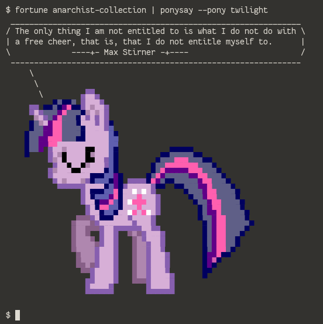

BLAG Fortune Assortment Project
===============================
This is my repository for my ongoing project to have English language anarchist fortunes in BLAG.

Requirements
------------
All you need is fortune mod. On Debian-based systems:

    $ sudo apt-get install fortune-mod

Installation
------------
To install:

    $ sudo ./install.sh

To uninstall:

    $ sudo ./uninstall.sh

Running
-------
To run the program, simply say

    $ fortune anarchist-collection
    When the people are being beaten with a stick, they are not much happier 
    if it is called "the People's Stick."
                ----+- Mikhail Bakunin -+----

Here is a more whimsical example:

Show fortunes on Bash startup
-----------------------------
> I want to see fortunes when my terminal starts, as in BLAG 140000!

To do this quickly, enter the following command:

    $ echo -e "\nfortune -s anarchist-collection\necho" >> $HOME/.bashrc

To disable the fortunes, remove these lines from $HOME/.bashrc:

    fortune -s anarchist-collection
    echo

Quote Sources
-------------
I have three sources for all my quotes:
- [Wikiquote](https://en.wikiquote.org)
- [BrainyQuote](https://www.brainyquote.com) (Generally requires verification)
- [Marxists Internet Archive](https://marxists.org)

